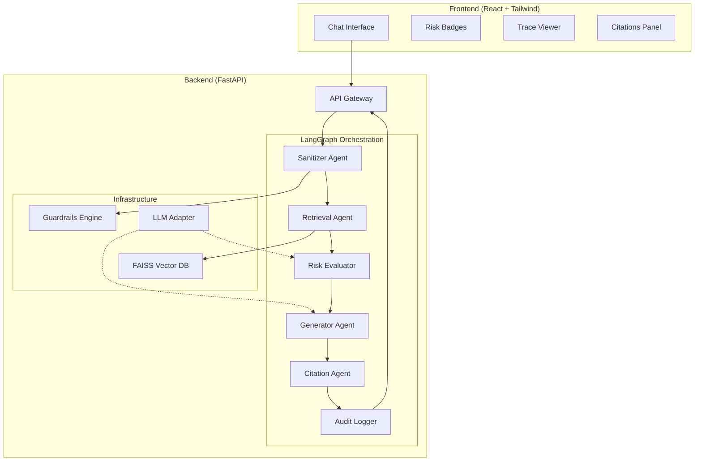

#  Risk Copilot - Multi-Agent LLM System for Risk Management

A production-ready demo showcasing multi-agent LLM orchestration for automated risk assessment and compliance verification, built for the Modern Banking Infrastructure.

## Project Overview

**Risk Copilot** is an intelligent system that:
-  Analyzes risk documents using RAG (Retrieval Augmented Generation)
-  Orchestrates multiple specialized AI agents via LangGraph
-  Enforces guardrails for PII protection and policy compliance
-  Provides full audit trails and explainability
-  Scales from demo to production with minimal changes

## Architecture



## Project Structure

```
risk-copilot/
├── backend/
│   ├── app/
│   │   ├── __init__.py
│   │   ├── main.py              # FastAPI application
│   │   ├── config.py            # Environment configuration
│   │   ├── models.py            # Pydantic models
│   │   └── api/
│   │       ├── __init__.py
│   │       ├── chat.py          # Chat endpoint
│   │       ├── traces.py        # Audit traces endpoint
│   │       └── health.py        # Health check
│   ├── agents/
│   │   ├── __init__.py
│   │   ├── graph.py             # LangGraph orchestration
│   │   ├── sanitizer.py         # Input sanitization agent
│   │   ├── retriever.py         # RAG retrieval agent
│   │   ├── risk_evaluator.py   # Risk assessment agent
│   │   ├── generator.py         # Response generation agent
│   │   ├── citation.py          # Citation extraction agent
│   │   └── logger.py            # Audit logging agent
│   ├── core/
│   │   ├── __init__.py
│   │   ├── faiss_index.py      # FAISS vector store
│   │   ├── guardrails.py       # Guardrails implementation
│   │   ├── llm_adapter.py      # LLM abstraction layer
│   │   └── embeddings.py       # Embedding generation
│   ├── data/
│   │   ├── policies/            # Policy documents
│   │   └── index/              # FAISS index storage
│   ├── tests/
│   ├── requirements.txt
│   ├── Dockerfile
│   └── .env.example
│
├── frontend/
│   ├── src/
│   │   ├── App.jsx
│   │   ├── components/
│   │   │   ├── ChatInterface.jsx
│   │   │   ├── RiskBadge.jsx
│   │   │   ├── TraceViewer.jsx
│   │   │   └── CitationPanel.jsx
│   │   ├── services/
│   │   │   └── api.js
│   │   └── styles/
│   │       └── tailwind.css
│   ├── public/
│   ├── package.json
│   ├── vite.config.js
│   └── netlify.toml
│
├── deploy/
│   ├── render.yaml              # Render deployment config
│   └── railway.json             # Railway deployment config
│
├── docs/
│   ├── ARCHITECTURE.md
│   ├── AGENTS.md
│   └── INTERVIEW_NOTES.md
│
├── .gitignore
├── README.md
└── LICENSE
```

##  Getting Started

### Prerequisites
- Python 3.10+
- Node.js 18+
- Git

### Day 1: Local Setup

```bash
# Clone the repository
git clone https://github.com/Kowshik13/multi-agent-risk-reporting.git
cd multi-agent-risk-reporting

# Backend setup
cd backend
python -m venv venv
source venv/bin/activate  # On Windows: venv\Scripts\activate
pip install -r requirements.txt
uvicorn app.main:app --reload

# Frontend setup (new terminal)
cd frontend
npm install
npm run dev
```


##  Tech Stack

| Layer | Technology | Purpose |
|-------|------------|---------|
| Frontend | React + Vite + Tailwind | Fast, modern UI |
| Backend | FastAPI + LangGraph | Async API + Agent orchestration |
| Vector DB | FAISS | Efficient similarity search |
| LLM | OpenAI/OpenRouter/Mock | Flexible model backend |
| Guardrails | Custom + Regex | Safety and compliance |
| Deployment | Render + Netlify | Free tier friendly |

##  Key Features

- **Multi-Agent System**: Specialized agents for different tasks
- **RAG Pipeline**: Grounded responses from policy documents
- **Guardrails**: PII protection, toxicity filtering, topic restrictions
- **Audit Trail**: Complete logging of all decisions
- **Risk Scoring**: Automatic risk level assessment
- **Citations**: Source attribution for transparency
- **Mock Mode**: Works without API keys for demos

##  Environment Variables

```env
# Backend (.env)
OPENAI_API_KEY=sk-...
OPENROUTER_API_KEY=...
USE_MOCK_LLM=false
LOG_LEVEL=INFO
CORS_ORIGINS=["http://localhost:5173", "https://your-netlify-app.netlify.app"]

# Frontend (.env)
VITE_API_URL=http://localhost:8000
```

##  License

MIT License - See LICENSE file for details

##  Author

Kowshik Raja - AI Risk Analyst 
- LinkedIn: [kowshik-raja](https://linkedin.com/in/kowshik-raja-a314bb202/)
- GitHub: [@Kowshik13](https://github.com/Kowshik13)
- Portfolio: [kowshik-raja.com](https://kowshik-raja.com)
